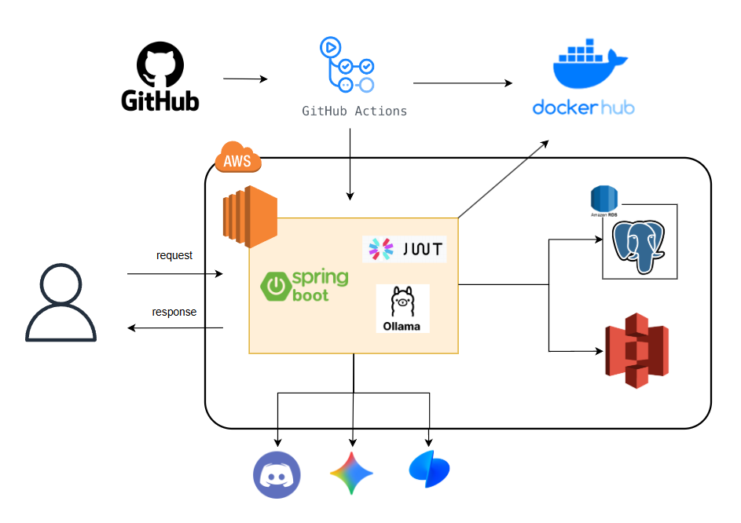
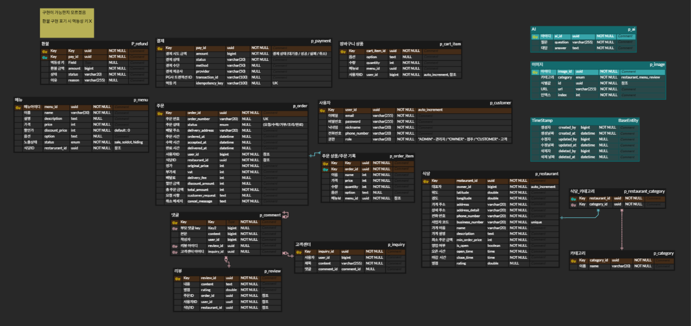

# 🍽️ 오늘의 밥상 (Today's Table)
> 주문 · 결제 · 리뷰까지 한 번에 관리하는 **스마트 음식 주문 플랫폼**

---

## 📖 프로젝트 소개

**오늘의 밥상**은 사용자가 음식점의 메뉴를 조회하고, 장바구니를 통해 주문 및 결제를 완료하며,  
리뷰와 코멘트까지 한 번에 관리할 수 있는 **통합 음식 주문 플랫폼**입니다.  

사장님(`OWNER`)은 주문을 직접 수락하고 조리 및 완료 상태를 변경할 수 있으며,  
고객(`CUSTOMER`)은 주문 내역과 리뷰를 간편하게 관리할 수 있습니다.  
또한 AI 기반의 **음식점 설명문구 자동 생성 기능**을 제공하여,  
사장님이 손쉽게 음식점 소개를 작성할 수 있습니다.

---

## 🧩 주요 기능

| 구분 | 설명 |
|------|------|
| 👤 **유저** | 회원가입, 로그인, JWT 기반 인증 및 권한 관리 |
| 🍱 **음식점 & 메뉴** | 음식점 등록 및 메뉴 CRUD, 카테고리 분류 |
| ⭐ **리뷰 & 코멘트** | 리뷰 작성, 조회, 코멘트 기능 제공 |
| 🛒 **주문 & 장바구니 & 결제** | 장바구니 담기, 주문 생성, 결제 처리 및 상태 관리 |
| 💬 **고객센터** | 문의 작성 및 AI 답변 기능 |
| 🤖 **AI 설명문구 생성** | AI 모델을 통한 음식점 소개문 자동 생성 |

> 🔗 **API 문서:** [Postman API Docs 바로가기](https://documenter.getpostman.com/view/33876991/2sB3QQJ7nr)

---

## ⚙️ 시스템 구성 (System Overview)

### 🧰 기술 스택

| 구분 | 사용 기술 |
|------|------------|
| **Backend** | Spring Boot(3.4.4), Spring Data JPA, QueryDSL |
| **Infra** | AWS EC2, AWS S3, GitHub Actions, DockerHub |
| **Integration & Resilience** | OpenFeign,Resilience4j |
| **Database** | PostgreSQL (AWS RDS) |
| **Security** | Spring Security, JWT 인증 |
| **Payment** | Toss Payments |
| **AI Integration** | Gemini API, Ollama |
| **CI/CD** | GitHub Actions + DockerHub + AWS 자동 배포 파이프라인 |
| **API Test** | Postman |
| **Etc.** | Gradle, Lombok, RESTful API |

---

### 🗂️ 디렉토리 구조

<details>
<summary>📁 계층 구조 보기</summary>

```bash
com.example.project
 ├── domain     # 도메인 모듈 계층
 ├── global     # 공통 모듈 계층
 ├── infra      # 인프라 연동 계층
```
</details>

<details>
<summary>🌐 global 패키지 구조 보기</summary>

```bash
global
├── audit
├── category
├── config
├── exception
├── unit
┃   ┣ common
┃   ┣ utils
```
</details>

<details>
<summary>🧩 domain 패키지 구조 보기</summary>

```bash
┣ user
 ┃   ┣ controller
 ┃   ┣ service
 ┃   ┣ domain
 ┃       ┣ User.java
 ┃   ┣ repository
 ┃       ┗ UserRepository.java
 ┃   ┗ dto
 ┃       ┣ UserRequestDto.java
 ┃       ┗ UserResponseDto.java
 ┣ menu
 ┃   ┣ controller
 ┃   ┣ service
 ┃   ┣ domain
 ┃       ┗ Menu.java
 ┃   ┣ repository
 ┃       ┗ MenuRepository.java
 ┃   ┗ dto
 ┃       ┣ MenuRequestDto.java
 ┃       ┗ MenuResponseDto.java
...
```
</details>

---

### ☁️ 시스템 아키텍처

<p style="text-align:center;">
  
</p>

### 🗂️ ERD

<p style="text-align:center;">
  
</p>

---

## 🚀 실행 방법

#### 1️⃣ 환경 변수 설정 (.env)

루트 경로에 `.env` 파일을 생성하고 아래 내용을 추가하세요.  
(⚠️ 실제 키 값들은 예시로 대체되어 있습니다.)

<details>
<summary>📄 .env 예시 보기</summary>

```bash
# DB
DB_HOST=localhost
DB_PORT=5432
DB_NAME=delivery
DB_USERNAME=postgres
DB_PASSWORD=your_password_here

# SERVER
PORT=8080
#각자 바꾸기

# JDBC URL
DB_URL=jdbc:postgresql://${DB_HOST}:${DB_PORT}/${DB_NAME}

# JPA
DDL_AUTO=update

# JWT
JWT_SECRET_KEY=your_jwt_secret_key_base64
JWT_EXPIRATION_ACCESSTOKEN=900000
# 15분 = 15 * 60 * 1000
JWT_EXPIRATION_REFRESHTOKEN=604800000
# 7일 = 7 * 24 * 60 * 60 * 1000

# tosSpay
TOSS_SECRET_KEY=test_gsk_docs_sample_key
TOSS_CLIENT_KEY=test_gck_docs_sample_key

# Discord
DISCORD_BOT_TOKEN=your_discord_bot_token
DISCORD_INQUIRY_CHANNEL_ID=channel_id1
DISCORD_RESTAURANT_CHANNEL_ID=channel_id2
DISCORD_AI_CHANNEL_ID=channel_id3

# S3
S3_ACCESS_KEY=your_s3_access_key
S3_SECRET_KEY=your_s3_secret_key
S3_REGION=ap-northeast-2
S3_BUCKET_NAME=sixdelivery

# Gemini
GEMINI_API_KEY=your_gemini_api_key
```

</details>


#### 2️⃣ Ollama 설치 및 모델 다운로드

고객센터 AI 답변기능은 **로컬 LLM 실행 환경인 Ollama**를 통해 동작합니다.  
아래 과정을 순서대로 따라 설치를 완료하세요.

##### 🪄 1. Ollama 설치
[https://ollama.com](https://ollama.com) 에 접속하여  
운영체제(Windows, macOS, Linux)에 맞는 버전을 다운로드합니다.

##### ⚙️ 2. 모델 다운로드
터미널(또는 명령 프롬프트)을 실행한 뒤 아래 명령어를 입력하여 모델을 다운로드합니다:

```bash
ollama pull qwen2.5:1.5b
```

##### ✅ 3. 설치 확인
아래 명령어를 터미널에 입력해 Ollama가 정상적으로 응답하는지 확인하세요:

```bash
curl http://localhost:11434/api/generate -d "{ \"model\": \"qwen2.5:1.5b\", \"prompt\": \"한국어로 대답해줘. 너는 어떤 모델이야?\", \"stream\": false }"
```

➡️ 응답으로 모델의 정보나 한국어 답변이 출력된다면 **Ollama 설치가 완료된 것입니다.**

> 💡 Ollama는 네트워크 연결 없이도 로컬에서 LLM을 실행할 수 있는 환경으로,  
> 고객센터의 AI 자동 답변 기능에 활용됩니다.

---

## 👥 역할 분담 (Role Assignment)

| 담당자 | 담당 기능 | 비고 |
|--------|------------|------|
| 👑 **지현** | 메뉴 / 리뷰 / 코멘트 | <span style="color:#f5b041; font-weight:600;">팀장 (Leader)</span> ✨ |
| 🍱 **래환** | 음식점(카테고리)/ API문서 작성 |  |
| 🛒 **교석** | 주문 / 장바구니/로그인 | JWT 연동 |
| 👤 **재영** | CI/CD |  |
| 💳 **승중** | 결제 / 고객센터(AI답변) | Toss/Ollama/Discord 연동 |
| 🤖 **진비** | AI / 이미지 처리 | Gemini / S3 연동 |

---

## ⚡ 핵심 기술 요약 (Core Implementation Highlights)

| 구분 | 핵심 기술 |
|------|------------|
| 💬 **AI (Gemini)** | 음식점의 설명문을 자동 생성하는 기능으로 사용. 입력된 음식점 정보 기반으로 자연어 문장 생성 |
| 🤖 **AI (Ollama)** | 고객센터 문의에 대해 로컬 LLM을 활용한 AI 자동 답변 기능 구현 |
| 🖼️ **이미지 관리 (AWS S3)** | 이미지 업로드·수정·삭제 로직과 함께 버킷 내 경로 구조화 및 다중 삭제 API 구현 |
| 🔐 **보안 (Spring Security, JWT)** | 사용자 권한(Role) 기반 접근 제어 및 Access/Refresh Token 인증 흐름 구성 |
| 💳 **결제 (Toss Payments)** | 토스페이 결제 API 연동 및 주문 상태 트랜잭션 처리 |
| 💬 **고객센터 (Discord Webhook)** | 문의 및 주문 관련 알림을 Discord 채널로 자동 전송 |
| 🔗 **외부 연동 (OpenFeign + Resilience4j)** | 외부 API 호출 시 FeignClient 기반 통신 및 CircuitBreaker 적용으로 장애 복원성 확보 |
| 🧩 **도메인 설계 (DDD 기반 구조)** | domain/global/infra 계층 분리, 도메인 단위 Repository & Service 구성 |
| 🚀 **CI/CD (GitHub Actions + DockerHub + AWS)** | main 브랜치 푸시 시 자동 빌드·배포 파이프라인 구현 |

---

<p style="text-align:center;">
  <b>🍽️ 오늘의 밥상 — 주문부터 결제, 리뷰까지 한 번에!</b>
</p>
